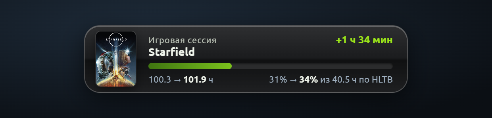
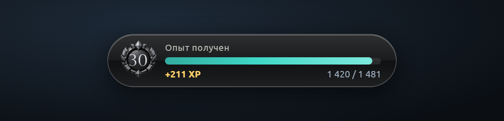
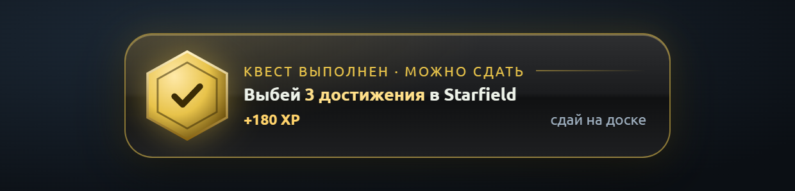
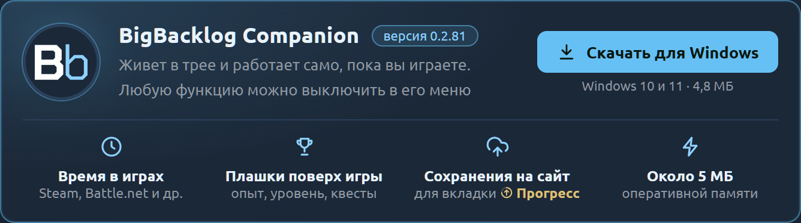
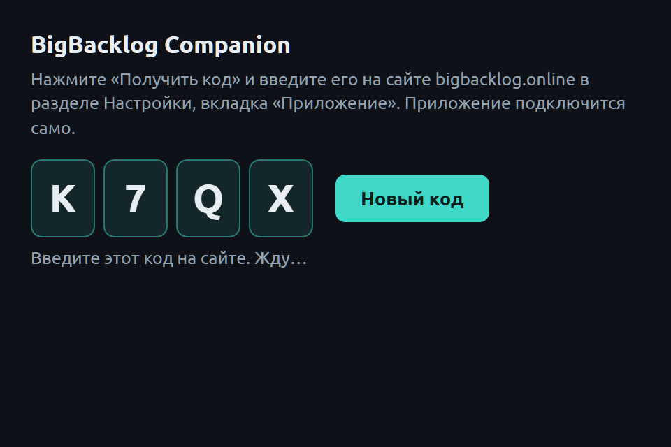
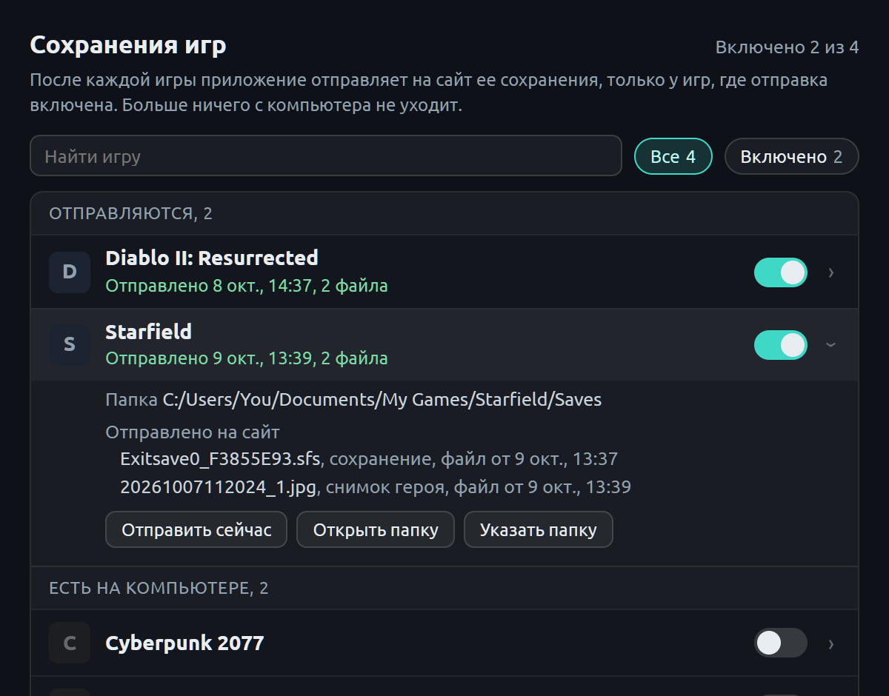

<p align="center"></p>

<h1 align="center">BigBacklog Companion</h1>

<p align="center">
  <br>
  <br>
  
</p>

Приложение для Windows к сайту [Big Backlog](https://bigbacklog.online). Живет в трее и работает само, пока вы играете:

- **считает время в играх** Steam, GOG, Battle.net и эмуляторов и отправляет игровые сессии на сайт;
- **показывает плашки поверх игры** в стиле Xbox 360: после выхода из игры одна плашка с итогом сессии, полученным опытом и выполненными квестами;
- **отправляет сохранения** поддерживаемых игр для вкладки «Прогресс» на сайте (только у тех игр, где вы это включили).

Около 5 МБ оперативной памяти в простое. Любую функцию можно выключить в меню приложения.

После игры приложение показывает одну плашку, которая по очереди перетекает из итога сессии в начисленный опыт, а затем в выполненные квесты (выше). Пока игра идет, ничего не всплывает.

<p align="center"></p>

## Установка

1. Скачайте exe со страницы [Releases](../../releases) или на сайте: **Настройки → Приложение → Скачать для Windows**.
2. Запустите. Exe пока без цифровой подписи, поэтому Windows может показать «Windows защитил ваш компьютер»: нажмите **«Подробнее» → «Выполнить в любом случае»**.
3. Если запустить из «Загрузок», с рабочего стола или из временной папки, приложение само перенесет себя в `%LOCALAPPDATA%\BigBacklog Companion` и запустится оттуда.
4. В окне приложения нажмите **«Получить код»** и введите 4 символа на сайте во вкладке **«Приложение»**. Никаких паролей и токенов вручную.

<p align="center"></p>

Нужны Windows 10 или 11 (x64) и компонент Microsoft WebView2 (в Windows 11 он есть всегда, в Windows 10 обычно приходит с обновлениями). Если его нет, приложение предложит скачать его с сайта Microsoft.

## Что приложение делает на компьютере

Мы хотим, чтобы это было полностью прозрачно. Ниже все, что приложение читает и отправляет; проверить можно по коду в этом репозитории.

### Как узнается, во что вы играете

- Раз в 5 секунд приложение берет у Windows список запущенных программ: только имя exe и путь к нему (право `PROCESS_QUERY_LIMITED_INFORMATION`). **Память игр, командная строка и содержимое окон не читаются**, поэтому для античитов это безопасно.
- Программа считается игрой, если ее exe лежит в папке установленной игры. Папки берутся из того, что лаунчеры сами пишут на диск: Steam (`libraryfolders.vdf`, `appmanifest_*.acf`), GOG (реестр), Battle.net (записи «Установка и удаление программ»).
- Эмуляторы (около 20) узнаются по имени exe, а игра в них по заголовку окна. Заголовок окна отправляется на сайт **только у эмуляторов** (и у Xbox 360, см. ниже).
- У запущенной Steam-игры приложение смотрит только **дату изменения** файла статистики Steam (не содержимое): если он обновился, сайт синхронизирует достижения этой игры.
- Выключается галочкой **«Считать время в играх»**.

### Что уходит на сайт

| Что | Когда |
|---|---|
| Игровая сессия: игра, начало, конец, минуты | раз в минуту, пока идет игра, и сразу после выхода |
| Список установленных игр GOG и Battle.net (чтобы они появились на полках) | когда список поменялся и раз в сутки, только при включенном «Считать время в играх» |
| Запрос состояния (опыт, квесты, последние сессии) | раз в 45 секунд |
| Сохранения игр | только у игр, где вы включили отправку (см. ниже) |

Путь к папкам на компьютере (в нем обычно имя пользователя Windows) **не отправляется**.

### Сохранения игр

**По умолчанию ничего не отправляется.** Отправку включают для каждой игры отдельно, на сайте на вкладке «Прогресс» или в окне «Сохранения игр для вкладки «Прогресс»». Сохранения уходят после выхода из игры, по кнопке «Отправить сейчас» и сразу после включения; только изменившиеся файлы. Приложение читает только эти папки и только эти файлы:

| Игра | Папка | Файлы |
|---|---|---|
| Diablo II: Resurrected | `Saved Games\Diablo II Resurrected` | персонажи `.d2s`, общий тайник `.d2i` |
| The Witcher 3 | `Documents\The Witcher 3\gamesaves` | последнее сохранение `.sav` |
| Sacred Gold | `save` в папке игры Steam | `GAMEnn.PAK` |
| Sacred 2 Remaster | `%LOCALAPPDATA%\Sacred2Remaster\user` | герои, общий сундук |
| The Binding of Isaac | облако Steam игры или `Documents\My Games\...` | `persistentgamedata1-3.dat` |
| Risk of Rain 2 | облако Steam игры и отчеты о забегах | `.xml` |
| Cyberpunk 2077 | `Saved Games\CD Projekt Red\Cyberpunk 2077` | свежее сохранение каждого прохождения |
| Megabonk | `AppData\LocalLow\Ved\Megabonk` | `progression.json`, `stats.json` |
| The Blood of Dawnwalker | `%LOCALAPPDATA%\Dawnwalker\Saved\SaveGames` | файлы сохранений |
| Starfield | `Documents\My Games\Starfield\Saves` | последнее `.sfs` и последний скриншот Steam этой игры |
| OpenMW (Morrowind) | `Documents\My Games\OpenMW\saves` | `.omwsave` |

Картинки уходят только у трех игр и только при включенной отправке: картинка, которую Cyberpunk сам кладет в сохранение; картинки из сохранений Dawnwalker; последний скриншот Steam из Starfield (сервер вырезает из него героя и хранит только его).

<p align="center"></p>

OpenMW синхронизируется в обе стороны: у каждого персонажа на сервер уходит и на другие устройства приходит только последнее сохранение, остальные остаются там, где их сделали. Удаленное на сайте приложение не стирает, а убирает в папку `.bigbacklog_deleted` рядом с сохранениями.

Где лежат сохранения части игр, приложение узнает от сайта (описание папки и файлов). Это позволяет добавлять игры без обновления приложения; описание работает только для игр, где вы включили отправку, и отправлять файлы можно только на адреса `/api/agent/` нашего сайта.

### Свои достижения модов Big Backlog

Для игр без своих достижений у Big Backlog есть моды с достижениями (Sacred Gold, OpenMW). Мод записывает события в папку `%APPDATA%\BigBacklogAgent\inbox` (OpenMW пишет строки `[BBACH]` в свой журнал `openmw.log`, приложение их переносит туда же), а приложение отправляет их на сайт и удаляет после отправки. Других строк журнала OpenMW приложение не берет. Без установленного мода папка пуста и ничего не уходит.

### Xbox 360 (по желанию)

Если вписать в `config.json` адрес приставки Xbox 360 с отладочным монитором (xbdm, только прошитые приставки), приложение по локальной сети смотрит, какая игра запущена, и забирает файлы достижений `.gpd`. По умолчанию выключено.

### Чего приложение не делает

Не снимает экран, не читает буфер обмена, не следит за клавиатурой и мышью, не читает память игр, данные браузеров и пароли, не сканирует сеть. Модули Windows для этого в сборку не подключены вовсе (см. `Cargo.toml`).

### Сеть

Приложение соединяется только с сайтом Big Backlog. Кроме того, окно плашки само загружает обложки игр (Steam CDN), а к Xbox 360 подключается по локальной сети, только если вы вписали ее адрес. HTTPS проверяется по встроенному списку корневых сертификатов и хранилищу Windows (чтобы работали антивирусы с проверкой защищенных соединений).

Вид плашек (`popups.js`, `popups.css`) приложение берет с сайта, поэтому их можно менять без обновления программы.

### Что хранится на компьютере

- `%APPDATA%\BigBacklogAgent\`: настройки и ключ подключения (`config.json`, открытым текстом, как у большинства таких программ), журнал работы `agent.log` (названия игр, имена файлов сохранений), отметки об уже отправленном, копия вида плашек.
- Автозапуск с Windows: только если вы включили галочку в меню (`HKCU\...\Run`).

### Обновления

Приложение проверяет обновления с сайта через минуту после запуска, раз в 6 часов и после каждой игровой сессии. Новая версия скачивается, сверяется по SHA-256 и ставится только когда тихо: игра не идет, все сыгранное отправлено, плашек на экране нет. Прежняя версия остается рядом как `bigbacklog-agent.old.exe`. Если главный поток приложения зависнет, сторож запишет это в журнал и перезапустит приложение.

## Сборка из исходников

Нужны [Rust](https://rustup.rs) (stable, целевая `x86_64-pc-windows-msvc`) и Node.js.

```
npm ci
npx tauri build --no-bundle
```

Готовый exe: `src-tauri/target/release/bigbacklog-agent.exe`.

Выпуски с тегом `v*` собирает [GitHub Actions](.github/workflows/build.yml): к exe прикладывается SHA-256 и подтверждение происхождения (из какого коммита и каким процессом собран файл), его можно проверить командой `gh attestation verify BigBacklogCompanion-<версия>.exe -R antngg/bigbacklog-companion`.

Признак сборки `dev` (`npx tauri build --features dev`) добавляет в меню тестовые плашки и отладочные пункты; такие сборки сайт выдает только разработчику.

## Устройство

| Файл | Что делает |
|---|---|
| `src-tauri/src/main.rs` | трей и меню, опрос сайта, очередь плашек, отправка сессий и сохранений |
| `src-tauri/src/scan.rs` | установленные игры и запущенные процессы |
| `src-tauri/src/saves.rs`, `specs.rs` | окно сохранений, игры из описаний сайта |
| `src-tauri/src/d2r.rs`, `w3.rs`, `sacred.rs`, `s2.rs`, `isaac.rs`, `ror2.rs`, `cp77.rs`, `openmw.rs` | сохранения отдельных игр |
| `src-tauri/src/update.rs` | самообновление |
| `src-tauri/src/install.rs` | первый запуск: WebView2, перенос из «Загрузок» |
| `src-tauri/src/tls.rs` | сертификаты HTTPS |
| `src-tauri/src/xbox360.rs` | Xbox 360 по локальной сети |
| `ui/` | окна: привязка, сохранения, плашка |

## Лицензия

[MIT](LICENSE)
