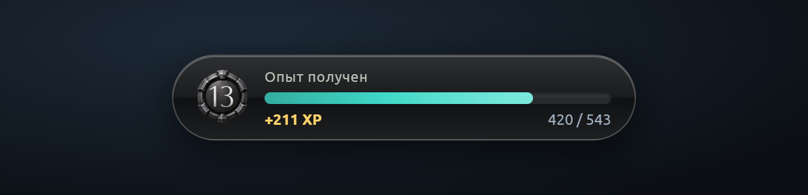
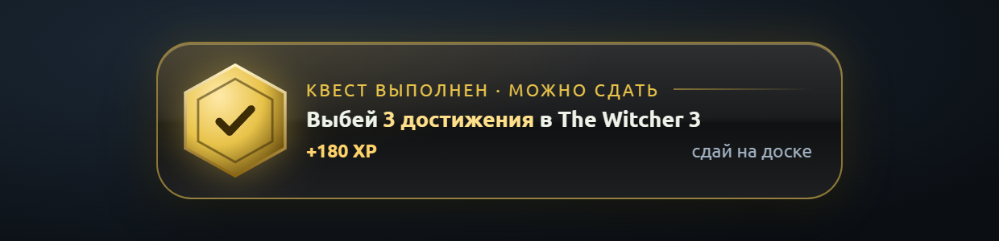
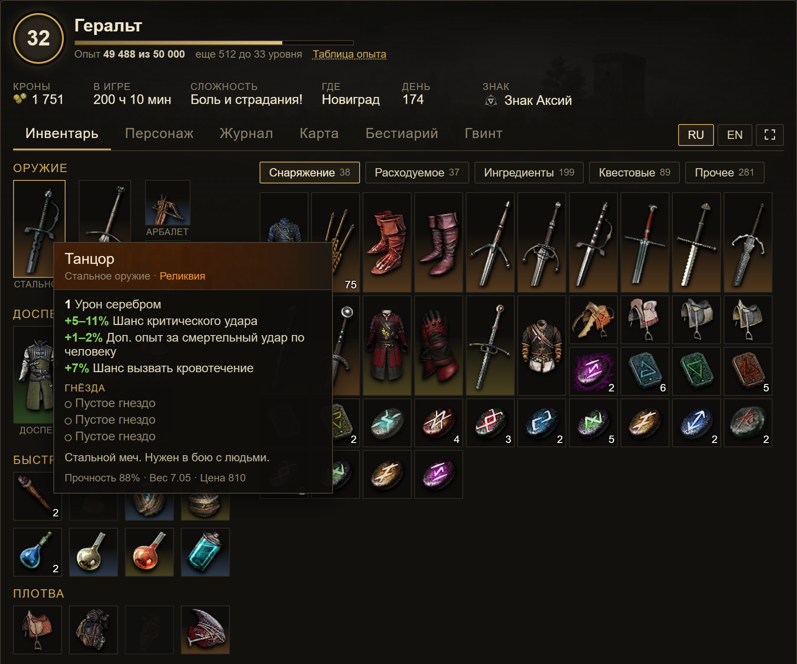
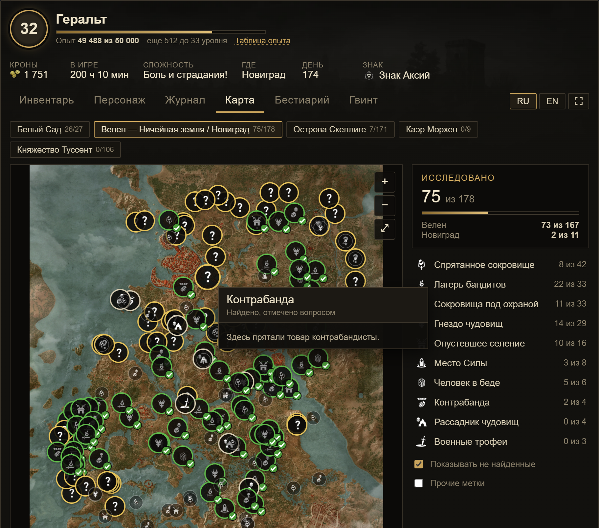
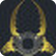
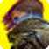
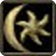
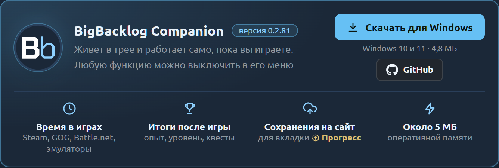
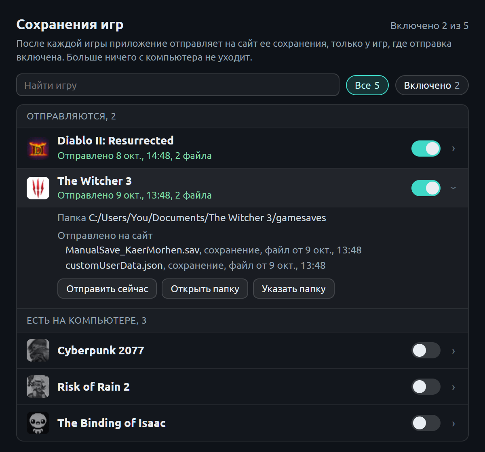

<p align="center"></p>

<h1 align="center">BigBacklog Companion</h1>

<p align="center">Приложение для Windows к сайту <a href="https://bigbacklog.online">Big Backlog</a>. Живет в трее и работает само, пока вы играете.</p>

<p align="center">
  <br>
  <br>
  
</p>

- **Время в играх** Steam, GOG, Battle.net и эмуляторов уходит на сайт игровыми сессиями.
- **После игры одна плашка**: итог сессии перетекает в полученный опыт, затем в выполненные квесты. Пока игра идет, ничего не всплывает.
- **Сохранения игр** для вкладки «Прогресс» на сайте: герой, снаряжение, навыки, карта, журнал, как в самой игре.

Около 5 МБ оперативной памяти в простое. Любую функцию можно выключить в меню приложения.

## Вкладка «Прогресс»

По сохранению игры сайт показывает героя так, как он выглядит в игре. Ниже The Witcher 3: инвентарь с подсказкой к предмету и карта с найденными местами.

<p align="center"></p>
<p align="center"></p>

Сейчас поддерживаются:

-  Diablo II: Resurrected
-  The Witcher 3
-  Sacred Gold
-  Sacred 2
-  The Binding of Isaac
-  Risk of Rain 2
-  Cyberpunk 2077
-  Megabonk
-  The Blood of Dawnwalker
-  Starfield
-  OpenMW

## Установка

1. Скачайте exe со страницы [Releases](../../releases) или на сайте: **Настройки → Приложение → Скачать для Windows**.
2. Exe пока без цифровой подписи, Windows может показать «Windows защитил ваш компьютер»: **«Подробнее» → «Выполнить в любом случае»**.
3. Из «Загрузок» или с рабочего стола приложение само переедет в `%LOCALAPPDATA%\BigBacklog Companion`.
4. Нажмите **«Получить код»** и введите 4 символа на сайте во вкладке **«Приложение»**. Паролей и токенов вручную не нужно.

<p align="center"></p>

Нужны Windows 10 или 11 (x64) и Microsoft WebView2 (в Windows 11 есть всегда; если его нет, приложение предложит скачать).

## Что приложение делает на компьютере

Все ниже можно проверить по коду в этом репозитории.

**Игры.** Раз в 5 секунд приложение берет у Windows список запущенных программ: только имя и путь exe. Игрой считается exe из папки установленной игры (папки берутся из файлов Steam, реестра GOG и записей Battle.net). **Память игр, командная строка и содержимое окон не читаются**, поэтому для античитов это безопасно. Заголовок окна нужен только эмуляторам, чтобы узнать игру. У запущенной Steam-игры приложение смотрит лишь дату изменения файла статистики Steam: обновился, значит, сайт синхронизирует ее достижения.

**Что уходит на сайт:** игровые сессии (игра, начало, конец, минуты); список установленных игр GOG и Battle.net, когда он меняется; сохранения игр, где вы это включили. Путь к папкам на компьютере (в нем имя пользователя Windows) не отправляется.

**Сохранения.** По умолчанию ничего не отправляется: отправку включают для каждой игры отдельно. Приложение читает только папку сохранений этой игры и только ее файлы, после выхода из игры, и шлет только изменившиеся. OpenMW синхронизируется между устройствами: по одному последнему сохранению на персонажа, удаленное на сайте убирается в `.bigbacklog_deleted`, а не стирается.

<p align="center"></p>

**Свои достижения.** Для игр без достижений у Big Backlog есть моды с ними (Sacred Gold, OpenMW). Мод кладет события в `%APPDATA%\BigBacklogAgent\inbox` (у OpenMW это строки `[BBACH]` в его журнале), приложение отправляет их и удаляет. Без мода папка пуста.

**Чего приложение не делает:** не снимает экран, не читает буфер обмена, клавиатуру и мышь, память игр, данные браузеров и пароли, не сканирует сеть. Соответствующие модули Windows в сборку не подключены (`Cargo.toml`).

**Сеть:** только сайт Big Backlog и обложки игр со Steam CDN для плашек. HTTPS проверяется по встроенным корневым сертификатам и хранилищу Windows. Вид плашек приложение берет с сайта.

**На диске:** `%APPDATA%\BigBacklogAgent` (настройки и ключ подключения в `config.json`, журнал `agent.log`, отметки об отправленном). Автозапуск с Windows только по галочке в меню.

**Обновления** проверяются после каждой игры и раз в 6 часов, сверяются по SHA-256 и ставятся, только когда игра не идет и на экране нет плашек.

## Сборка

Нужны [Rust](https://rustup.rs) (stable, `x86_64-pc-windows-msvc`) и Node.js.

```
npm ci
npx tauri build --no-bundle
```

Готовый exe: `src-tauri/target/release/bigbacklog-agent.exe`. Выпуски с тегом `v*` собирает [GitHub Actions](.github/workflows/build.yml) и прикладывает подтверждение происхождения: `gh attestation verify BigBacklogCompanion-<версия>.exe -R antngg/bigbacklog-companion`.

## Лицензия

[MIT](LICENSE). У шрифтов свои лицензии, см. [ui/fonts](ui/fonts/LICENSES.md).
